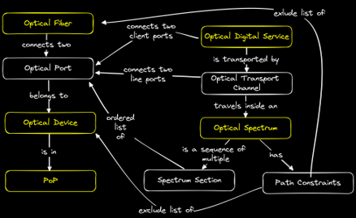

# GARR Workflow Orchestrator (WFO)

<div align="center">


[](https://github.com/astral-sh/ruff)
[](http://mypy-lang.org/)

**Automated orchestration system for GARR optical transport network lifecycle management**

[Features](#features) •
[Architecture](#architecture) •
[Usage](#usage) •
[Resources](#resources)

</div>

---

## 📋 Table of Contents

- [Overview](#overview)
- [Features](#features)
- [Architecture](#architecture)
- [Product Catalog](#product-catalog)
- [Usage](#usage)
- [Development](#development)
- [License](#license)

---

## 🔭 Overview

The **GARR Workflow Orchestrator (WFO)** is a comprehensive service lifecycle management platform designed for the Italian Research and Education Network (**GARR**). Built on top of the [orchestrator-core](https://github.com/workfloworchestrator/orchestrator-core) framework, it provides automated provisioning, modification, validation, and termination of optical transport services across GARR's national backbone network.

### What It Does

- **Manages optical network infrastructure**: Sites (PoPs), optical devices (transponders, ROADMs), fiber links, and spectrum allocation
- **Provisions end-to-end services**: 100GbE and 400GbE Ethernet connections across Italy's research network
- **Automates device configuration**: Interfaces with  optical equipment via TL1, NETCONF, and RESTCONF
- **Maintains network inventory**: Synchronizes with NetBox DCIM/IPAM
- **Ensures service quality**: Validates configurations and detects drift

### Why It Exists

Traditional network administration relies on manual processes, CLI commands, and fragmented tooling, leading to errors, inconsistencies, and slow service delivery. WFO provides:

- **Structured workflows** with input validation and error handling
- **Centralized state management** tracking every resource and subscription
- **Audit trails** for compliance and troubleshooting
- **API-driven automation** enabling integration with OSS/BSS systems
- **Self-service capabilities** (when integrated with portals)

---

## 🚀 Usage

This project contains business logic that is heavily customized for GARR's optical network. You can use this as a reference to build your own [Orchestrator](https://workfloworchestrator.org/). Another implementation to take inspiration from is that of [GEANT](https://gitlab.software.geant.org/goat/gap/geant-service-orchestrator/-/tree/develop/gso?ref_type=heads). 

> [!IMPORTANT]
> If you reuse part of this code, please give credits (see [LICENSE](LICENSE) and [NOTICE](NOTICE)).

---

## ✨ Features

### Core Capabilities

- 🚀 **Full Lifecycle Management** - Create, modify, validate, and terminate network services
- 🔄 **State Reconciliation** - Detect and remediate configuration drift
- 🗄️ **PostgreSQL Backend** - Reliable, auditable data persistence
- ⚡ **Async Task Execution** - Celery-based workflow processing
- 🌈 **Multi-Vendor Support** - Clients for the network devices are written directly in Python, eliminating the need for external configuration managers while reducing complexity

---

## 🏗️ Architecture

### Design Patterns

- **Domain-Driven Design**: Product blocks model real network components with lifecycle states
- **Declarative Workflows**: Step-by-step functions with clear inputs/outputs
- **Idempotency**: Steps designed to be safely retried
- **Separation of Concerns**: Products, workflows, and external services are decoupled
- **Event Sourcing**: Process steps logged for audit and debugging

---

## 📦 Product Catalog

WFO manages six core product types representing optical network resources:

### Infrastructure Products

| Product | Description | Key Attributes |
|---------|-------------|----------------|
| **Partner** | Network partners and customers | Name, organization details |
| **PoP** | Points of Presence (sites) | Name, location (lat/lon), address, NetBox sync |
| **Optical Device** | Transponders, ROADMs, amplifiers | Device type, vendor (Infinera), location, management IP, ports |
| **Optical Fiber** | Physical fiber connections | Endpoints (devices/sites), fiber type, length, loss budget |

### Service Products

| Product | Description | Key Attributes |
|---------|-------------|----------------|
| **Optical Spectrum** | Frequency channels on fibers | Center frequency, bandwidth, modulation, optical path routing |
| **Optical Digital Service** | End-to-end Ethernet connectivity | Service type (100GbE/400GbE), client ports, transport channels, flow/client IDs |

### Relationships



---

## 🛠️ Development

### Project Structure

```
garr/
├── auth/                      # OAuth2/OIDC authentication
├── cli/                       # Custom CLI commands
├── migrations/                # Alembic database migrations
│   └── versions/schema/       # Schema migration files
├── products/                  # Domain models
│   ├── product_blocks/        # Reusable building blocks
│   ├── product_types/         # Product definitions
│   ├── services/              # Business logic layer
│   └── shared/                # Shared types and utilities
├── schedules/                 # Scheduled task definitions
├── services/                  # External integrations
│   ├── infinera/              # Optical device clients
│   │   ├── core/              # TNMS client
│   │   ├── flexils/           # FlexILS TL1 client
│   │   ├── g30/               # G30 RESTCONF client
│   │   └── g42/               # G42 RESTCONF client
│   ├── netbox.py              # NetBox DCIM/IPAM client
│   └── processes.py           # Process management utilities
├── templates/                 # YAML templates for products (deprecated)
├── utils/                     # Helper functions and custom types
├── workflows/                 # Workflow implementations
│   ├── optical_device/        # Device workflows
│   ├── optical_fiber/         # Fiber workflows
│   ├── optical_spectrum/      # Spectrum workflows
│   ├── optical_digital_service/  # Service workflows
│   ├── partner/               # Partner workflows
│   ├── pop/                   # PoP workflows
│   └── tasks/                 # System tasks
├── main.py                    # Application entry point
├── settings.py                # Configuration
├── pyproject.toml             # Project metadata and dependencies
└── README.md                  # This file
```

---

## 📄 License

Copyright © 2025 GARR - Consortium for the Italian Research and Education Network

Licensed under the **Apache License, Version 2.0** (the "License");
you may not use this software except in compliance with the License.
You may obtain a copy of the License at:

**http://www.apache.org/licenses/LICENSE-2.0**

Unless required by applicable law or agreed to in writing, software
distributed under the License is distributed on an "AS IS" BASIS,
WITHOUT WARRANTIES OR CONDITIONS OF ANY KIND, either express or implied.
See the License for the specific language governing permissions and
limitations under the License.

See the [LICENSE](LICENSE) file for full license text.

---

## 🙏 Acknowledgments

- **GARR**: For sponsoring and driving requirements
- **Orchestrator Core Community**: For the excellent [foundation framework](https://workfloworchestrator.org/)
- **Contributors**: Matteo Colantonio for the backend development and Filippo Landini for the deployment
---

## 📚 Resources

- [Workflow Orchestrator Project](https://workfloworchestrator.org/)
- [GEANT's Orchestrator](https://gitlab.software.geant.org/goat/gap/geant-service-orchestrator/)
- [Presentation about this project](https://www.youtube.com/watch?v=5ZhNN28xgmo)

---

<div align="center">

**[⬆ Back to Top](#garr-workflow-orchestrator-wfo)**

Made with ❤️ by the GARR Optical Network Engineering and DevOps Teams

</div>
